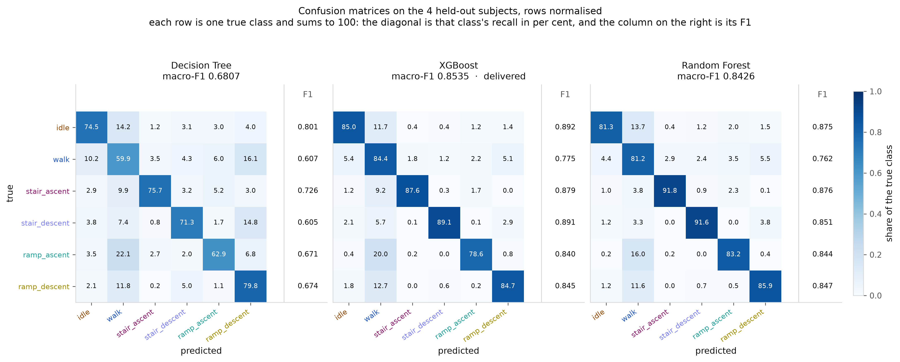
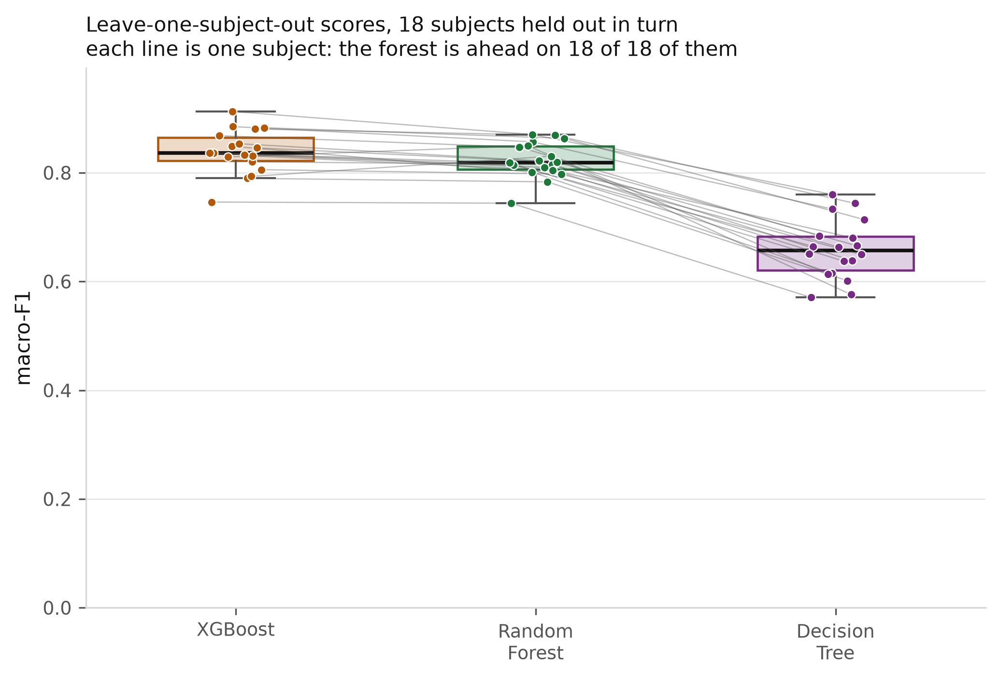
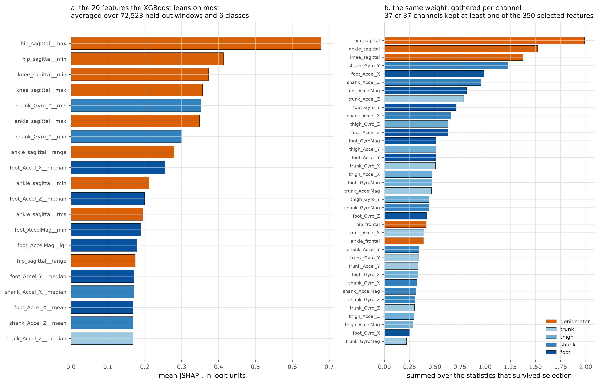

# Locomotion Mode Recognition from Exoskeleton-Embeddable Sensors

Recognising six locomotion modes — **idle, walk, stair ascent/descent, ramp ascent/descent** — from 250 ms windows of IMU and goniometer signals alone: the sensors a lower-limb exoskeleton can actually carry. EMG, force plates and motion capture are available in the source dataset and are **excluded by design**.

The protocol is subject-independent from the first step. Four of the 22 subjects are held out before anything is plotted and opened exactly once, at the end.

> Data Mining & Machine Learning — M.Sc. in Bionics Engineering, University of Pisa
> Andrea Diano · Riccardo Mambrini

📄 **[Report](deliverables/report.pdf)** · 🎞 **[Slides](deliverables/presentation.pdf)** · 📓 **[Notebook](notebook/LMR_AD_RM.ipynb)** (renders directly on GitHub, outputs included)

---

## Results

Macro-F1 across six classes. Validation is the mean over 18 leave-one-subject-out folds; test is the single evaluation on the four held-out subjects.

| Model | Configurations searched | Validation macro-F1 | Test macro-F1 | Test accuracy |
|---|---:|---:|---:|---:|
| Decision Tree *(baseline)* | 27 | 0.6590 ± 0.0543 | 0.6807 | 0.6950 |
| Random Forest | 18 | 0.8232 ± 0.0326 | 0.8426 | 0.8325 |
| **XGBoost** *(delivered)* | 30 | **0.8389 ± 0.0400** | **0.8535** | 0.8429 |

A classifier drawing at random with the training class frequencies scores 1/6 ≈ 0.167 whatever the imbalance, so the floor is known rather than measured.

**Per-class F1 on the held-out subjects (XGBoost)**

| idle | walk | stair ascent | stair descent | ramp ascent | ramp descent |
|---:|---:|---:|---:|---:|---:|
| 0.892 | 0.775 | 0.879 | 0.891 | 0.840 | 0.845 |

**Paired comparison over the same 18 folds** (Wilcoxon signed-rank, Holm-corrected)

| Comparison | Δ macro-F1 | 95% CI | p (Holm) | Folds won |
|---|---:|---|---:|---:|
| XGBoost − Random Forest | +0.0157 | [+0.0063, +0.0251] | 0.0056 | 16/18 |
| Random Forest − Decision Tree | +0.1642 | [+0.1472, +0.1811] | 0.0000 | 18/18 |

Choosing an ensemble over a single tree is worth +0.164. Choosing boosting over bagging is worth +0.016 — real and significant, but a tenth of the first. The family choice dominates everything else in this project.

<p align="center">
  
</p>
<p align="center"><em>Confusion matrices on the four held-out subjects, with per-class F1 beside each panel.</em></p>

---

## What the data says

**The spread between people dwarfs the spread between hyperparameters.** For the Decision Tree, all 27 configurations fall inside a band narrower than the gap between subjects: which person is held out changes the score more than any setting in the grid. This is why every comparison here is paired fold by fold rather than treated as independent samples.

<p align="center">
  
</p>

**What separates the sensors is the plane, not the technology.** Ranked by mutual information, joint angles and inertial units come out close to equal as groups. What actually splits them is the sagittal plane against the frontal one: the angle measured in the plane of walking leads all 37 channels, while the two frontal-plane angles are the worst. Walking, climbing and descending happen in the sagittal plane; the frontal plane mostly records side-to-side sway that all six classes share.

**The model and the feature ranking disagree, informatively.** Mutual information led with accelerometer and gyroscope statistics. The model built on exactly that ranking makes hip, ankle and knee flexion its top three channels of 37, holding 26% of the weight — because MI scores a feature *on its own*, while a Shapley value scores what the model does with it *given the other 349*. The ankle outranks the knee in the fitted model although univariate exploration put the knee first: it carries information invisible one channel at a time.

<p align="center">
  
</p>

**The explanation argues against the score.** Statistics that move when a constant offset is added — means, medians, extremes, RMS — are 47% of the selected features and take 71% of the weight, and three quarters of that weight sits on IMU channels, where a mean is largely orientation with respect to gravity: how the sensor happened to be strapped on that day. Every subject was recorded on a single day, so this dataset cannot say how much of the score would survive a change of session.

**`walk` is not a broken label — and the measurement that settled it was named in advance.** `walk` scores worst of all six classes while being the second most common, which invites the conclusion that the label is a bin holding the transitions absorbed into it. Two hypotheses predict opposite failures: *dilution* predicts recall collapses, *geometry* predicts precision collapses while recall stays high. **F1 cannot tell them apart, because it is low under either.** Fixing recall-on-stationary-windows as the deciding measurement *before* computing it gives precision 0.673 against recall 0.910 — over-assignment, not misrecognition. `walk` borders every other state; a shallow ramp is walking at an inclination. The label mapping stands.

An earlier version of this analysis read the low F1, concluded dilution, and recommended discarding the pipeline. Nothing was wrong with the data or the model — the metric simply could not arbitrate.

---

## How leakage is kept out

This is the part of the project the rest is built on.

- **The split is frozen before any plot exists.** Four subjects, drawn one per quartile of recording volume by seed rather than by hand, only from subjects alone on their recording day. Windowing and feature extraction learn nothing from the dataset as a whole and are safe to run on everything; the leak is in the decisions *people* make while looking at data. Pick channels from a correlation matrix over all 22 subjects and test information has entered the model — and no `Pipeline` can unfit a choice a human made.
- **Feature selection produces no reduced dataset.** Ranking the 555 features on all the data would be leakage in its purest form. What is built instead is one mutual-information ranking **per fold**, estimated on that fold's training rows only. `k` is never decided here: it enters the hyperparameter search as an axis over {75, 150, 350}.
- **Rankings are checked for the right kind of disagreement.** Identical rankings across folds would prove a selector saw more than its own 17 subjects; a top that changed wholesale would mean the search is fitting one particular set of people. Overlap is measured against chance, since two random choices of `k` out of 555 already agree on `k`/555.
- **The folds are sealed with a sha256.** Splits, already-undersampled training indices and per-fold rankings are frozen together into one file. Every cell that consumes it recomputes the hash and stops on a mismatch — which is what lets three models be tuned in separate sessions and still be compared by a *paired* test. Had the partitions drifted, the test would not have failed; it would have quietly returned p-values that mean nothing.
- **`idle` is undersampled on the training side only**, so every validation fold keeps the class proportions the recording actually has.
- **Features are verified, not assumed.** Counting rows written against windows expected would stay true if the axes were transposed or every slice were off by one sample. A random sample of windows is instead rebuilt from the raw Parquet through a different code path and compared: worst disagreement at the precision limit of `float32`, no label differing.

---

## The dataset

[EPIC Lab lower-limb biomechanics dataset](https://www.epic.gatech.edu/opensource-biomechanics-camargo-et-al/) (Camargo et al., 2021) — 22 able-bodied adults, stairs, ramps, level ground and treadmill. The treadmill condition is excluded here by design. See [`docs/dataset.md`](docs/dataset.md) for the structure, sensors and label conventions.

| | |
|---|---|
| Subjects | 22 — 18 development, 4 held out |
| Trials | 2,990 over 3 circuits |
| Labelled samples | 9,917,736 (13.8 h at 200 Hz) |
| Sensor channels | 29 recorded (24 IMU, 5 goniometer) → 37 with derived magnitudes |
| Invalid values | 3,985 cells (0.0014%), counted and left in place |
| Windows | 392,292 of 250 ms at a 125 ms stride |
| Features | 555 — 15 statistics × 37 channels |
| Class imbalance | 6.5 : 1, largest over smallest |

The dataset itself is **not redistributed here** (≈3.8 GB, and it belongs to its authors). Download it from the link above into `Dataset_Camargo/`.

---

## Repository layout

```
notebook/        LMR_AD_RM.ipynb — the whole pipeline, 72 cells, outputs included
                 nb_utils.py     — paths, palette, plotting style, figure export
src/config.py    paths and constants — nb_utils locates the project root by it
figures/         the 14 figures, as produced by the notebook
deliverables/    report.pdf · presentation.pdf
docs/dataset.md  dataset structure, sensors, classes, label conventions
```

Everything runs from the notebook. It was distilled from a set of numbered stage scripts, one per step, each checkpointing its own output; those are kept out of this repository because their comments and reports are in Italian while everything here is in English. Nothing in the notebook depends on them.

---

## Reproducing it

```bash
python -m pip install -r requirements.txt
jupyter lab notebook/LMR_AD_RM.ipynb
```

Python 3.11 or 3.12 (some dependencies have no 3.13 wheels). `Restart & Run All` takes roughly **13–14 hours from cold**, most of it hyperparameter search, and needs the dataset in `Dataset_Camargo/` plus about 4 GB free. Every long stage checkpoints and resumes where it stopped, so an interrupted run does not start over. Figures are written to `figures/`.

The heavy intermediates — the Parquet cache, the fitted models, the SHAP values — are not in the repository: `shap_values.npy` alone is 609 MB. They are all regenerated by running the notebook.

---

## Limitations

Stated in full in [§5 of the notebook](notebook/LMR_AD_RM.ipynb) and in the report. The short version:

- The headline figure is an estimate from **four people**, and its standard error is the same size as several of the differences discussed above. It is a value with a wide interval, not a measurement.
- **Nothing here crosses a session.** Every subject was recorded on a single day, and §4.2 shows a measurable share of the model's weight sitting on statistics that encode sensor mounting.
- A 250 ms window makes the spectral bins wider than the differences in step rate that separate walking speeds, so **nothing in the feature set represents gait rhythm**.
- **No sensor ablation was run** — it was priced and deliberately skipped. "Which sensors could a real exoskeleton leave out" has no answer here, because a Shapley value measures how much a model uses a channel, not what it would cost to lose it.
- The protocol is a prescribed circuit in a controlled setting, not a life.

---

## Citation

The dataset:

> Camargo, J., Ramanathan, A., Flanagan, W., & Young, A. (2021). A comprehensive, open-source dataset of lower limb biomechanics in multiple conditions of stairs, ramps, and level-ground ambulation and transitions. *Journal of Biomechanics*. https://doi.org/10.1016/j.jbiomech.2021.110320

---

## License

Code — the notebook, `nb_utils.py` and `src/` — is released under the [MIT License](LICENSE).

The report and the presentation in `deliverables/` are coursework, shared under [CC BY 4.0](https://creativecommons.org/licenses/by/4.0/): reuse them with attribution.

The dataset is not covered by either and remains under the terms set by its authors.
